# Báo cáo đánh giá Anti-Spoofing (MiniFASNet vs ViT-FAS vs FaceAntispoof-ONNX)

> Mẫu báo cáo — điền nội dung vào từng mục. Cập nhật ngày / phiên bản khi hoàn thiện.

| | |
|---|---|
| **Tác giả** |Vũ Hồng Quang|
| **Ngày** |01/06/2026|
| **Repo / branch** |main|
| **Môi trường** | Python, OS, GPU/CPU |

---

## 1. Tóm tắt (Executive summary)

- Mục tiêu: đánh giá stage anti-spoofing cho bài toán verify ảnh tài xế trước khi tích hợp service.
- Model đã đánh giá: **MiniFASNetV2** (`minifasnet_v2_2p7`), **ViT-FAS** (`vitfas_vitb16_224`) và **FaceAntispoof-ONNX** (`face_antispoof_onnx_9820`).
- Dataset đã dùng: ma trận **3 model × 7 dataset** (CelebA, CASIA, Face VN, drivers × 4 SFAS expansion); benchmark `run_inference.py --all` + `run_evaluation.py --all`.
- Kết luận chính: MiniFASNet vẫn là model tốt nhất trên CASIA-FASD. FaceAntispoof-ONNX cho kết quả cạnh tranh trên CelebA-Spoof (ACER thấp nhất @0.5) và xếp thứ hai trên CASIA-FASD. Trên **face_antispoofing_vn**, FaceAntispoof-ONNX tốt nhất về accuracy/APCER @0.5 nhưng BPCER cao. Trên **drivers_250_fn @ SFAS exp 1.0**, cả 3 model đều NO-GO (BPCER cao). Sau ablation expansion, **MiniFASNet @ exp 1.6** đạt **BPCER 0.0481 @0.5** (14/291 live bị reject) — dưới ngưỡng acceptance gate đề xuất (≤ 0.10), cần xác nhận thêm trước rollout.
- Đề xuất tích hợp service: ưu tiên metric vận hành theo **BPCER trên live thực tế**; giữ MiniFASNet làm baseline; dùng ONNX khi cần ưu tiên chống spoof và có calibrate threshold theo production.

---

## 2. Mục tiêu và phạm vi

### 2.1 Mục tiêu

- 
- 

### 2.2 Phạm vi / ngoài phạm vi

- Trong phạm vi:
- Không làm trong đợt này:

## 3. Khảo sát model anti-spoofing

### 3.1 Danh sách model đã xem xét

| Model / repo | Nguồn | Ghi chú |
|--------------|-------|---------|
| MiniFASNet (Silent-Face-Anti-Spoofing) | | |
| Vision Transformers (ViT)| | |
| Face Anti-Spoof ONNX | | |

### 3.2 Tiêu chí so sánh

- Độ chính xác / ACER trên tập test
- Tốc độ inference, yêu cầu GPU
- Dễ deploy (Docker, weight, license)
- Khả năng mở rộng (fine-tune, API)

### 3.3 Model được chọn cho thí nghiệm đầu tiên

- **Tên model:** MiniFASNetV2 (Silent-Face-Anti-Spoofing).
- **Lý do chọn:** phổ biến, nhẹ, dễ tích hợp, có sẵn wrapper/pipeline ổn định trong repo.
- **Weight / config:** `configs/model_minifasnet.yaml`, `models/`.

---

## 4. Dataset

### 4.1 Dataset sử dụng

| Dataset | Nguồn (HF / local) | Ghi chú |
|---------|-------------------|---------|
| CelebA-Spoof | |Chủ yêu là hình ảnh người phương Tây|
| CASIA-FASD | |Chủ yếu là hình ảnh người Trung Quốc, nên phù hợp hơn với bài toán này|
| Face Anti-Spoofing VN | `vu-hong-quang/face_antispoofing_vn` (HF private) | Ảnh tài xế VN, crop SFAS, split `test` |
| Drivers 250 FN | `data/drivers_250_fn_cropped` (local) | Ảnh thực tế false-negative, toàn bộ nhãn live, split `all` |

### 4.2 Số lượng ảnh (sample / test)

| Dataset | Tổng | Live | Spoof | Unknown / lỗi |
|---------|------|------|-------|----------------|
| celeba_spoof | 4000 | 2000 | 2000 | 0 |
| casia_fasd | 4063 | 995 | 3068 | 0 |
| face_antispoofing_vn | 2118 | 782 | 1336 | 0 |
| drivers_250_fn | 291 | 291 | 0 | 0 |

*(Đường dẫn CSV: `data/sampled/`, `data/raw/.../annotations/raw.csv`.)*

### 4.3 Đặc điểm tiền xử lý dữ liệu đầu vào

- CelebA-Spoof (`cropped_image`): không cần tiền xử lý gì thêm
- CASIA-FASD (`cropped_image` 256×256, v.v.): không cần tiền xử lý gì thêm
- Face Anti-Spoofing VN: ảnh đã crop mặt trên HF; inference resize theo từng model (80×80 / 128×128 / 224×224)
- Crop offline CASIA (`data/processed/casia_fasd/`): có / không — ghi chú

---

## 6. Thiết lập thí nghiệm

### 6.1 Cấu hình

| Thành phần | File / giá trị |
|------------|----------------|
| Model | `configs/model_minifasnet.yaml` |
| Inference | `configs/inference.yaml` |
| Dataset CelebA | `configs/dataset_celeba_spoof.yaml` |
| Dataset CASIA (raw / cropped) | `configs/dataset_casia_fasd.yaml` / `dataset_casia_fasd_cropped.yaml` |
| Dataset Face VN | `configs/dataset_face_antispoofing_vn.yaml` |
| Dataset Drivers FN | `configs/dataset_drivers_250_fn.yaml` |
| Evaluation | `configs/evaluation.yaml` |

### 6.2 Preprocessing

- Input size:
- Threshold mặc định:
- Crop detect + scale (CASIA):

### 6.3 Lệnh chạy (tham chiếu)

```bash
# Inference MiniFASNet
python3 scripts/run_inference.py \
  --dataset-config configs/dataset_celeba_spoof.yaml \
  --model-config configs/model_minifasnet.yaml \
  --inference-config configs/inference.yaml

python3 scripts/run_inference.py \
  --dataset-config configs/dataset_casia_fasd.yaml \
  --model-config configs/model_minifasnet.yaml \
  --inference-config configs/inference.yaml

# Inference ViT-FAS
python3 scripts/run_inference.py \
  --dataset-config configs/dataset_celeba_spoof.yaml \
  --model-config configs/model_vit_fas.yaml \
  --inference-config configs/inference.yaml

python3 scripts/run_inference.py \
  --dataset-config configs/dataset_casia_fasd.yaml \
  --model-config configs/model_vit_fas.yaml \
  --inference-config configs/inference.yaml

# Evaluation (sau khi có latest.csv theo từng model)
python3 scripts/run_evaluation.py --dataset celeba_spoof
python3 scripts/run_evaluation.py --dataset casia_fasd

# Inference / evaluation — Face Anti-Spoofing VN
python3 scripts/run_inference.py \
  --dataset-config configs/dataset_face_antispoofing_vn.yaml \
  --model-config configs/model_minifasnet.yaml

python3 scripts/run_evaluation.py --dataset face_antispoofing_vn

# Inference / evaluation — Drivers 250 FN (dữ liệu thực tế)
python3 scripts/run_inference.py \
  --dataset-config configs/dataset_drivers_250_fn.yaml \
  --model-config configs/model_minifasnet.yaml
python3 scripts/run_inference.py \
  --dataset-config configs/dataset_drivers_250_fn.yaml \
  --model-config configs/model_vit_fas.yaml
python3 scripts/run_inference.py \
  --dataset-config configs/dataset_drivers_250_fn.yaml \
  --model-config configs/model_face_antispoof_onnx.yaml

python3 scripts/run_evaluation.py \
  --predictions reports/models/minifasnet_v2_2p7/predictions/drivers_250_fn/latest.csv \
  --dataset drivers_250_fn
python3 scripts/run_evaluation.py \
  --predictions reports/models/vitfas_vitb16_224/predictions/drivers_250_fn/latest.csv \
  --dataset drivers_250_fn
python3 scripts/run_evaluation.py \
  --predictions reports/models/face_antispoof_onnx_9820/predictions/drivers_250_fn/latest.csv \
  --dataset drivers_250_fn
```

### 6.4 Metric báo cáo

- Accuracy, Precision, Recall, F1 (live / spoof)
- **APCER**, **BPCER**, **ACER**
- Confusion matrix (theo threshold)
- Ngưỡng thử: `thresholds: [...]`

---

## 7. Kết quả

### 7.1 CelebA-Spoof

- File predictions:
  - MiniFASNet: `reports/models/minifasnet_v2_2p7/predictions/celeba_spoof/latest.csv`
  - ViT-FAS: `reports/models/vitfas_vitb16_224/predictions/celeba_spoof/latest.csv`
  - FaceAntispoof-ONNX: `reports/models/face_antispoof_onnx_9820/predictions/celeba_spoof/latest.csv`
- File metrics:
  - MiniFASNet: `reports/models/minifasnet_v2_2p7/metrics/celeba_spoof/`
  - ViT-FAS: `reports/models/vitfas_vitb16_224/metrics/celeba_spoof/`
  - FaceAntispoof-ONNX: `reports/models/face_antispoof_onnx_9820/metrics/celeba_spoof/`

| Model | Threshold | Accuracy | APCER | BPCER | ACER |
|-------|-----------|----------|-------|-------|------|
| MiniFASNet | 0.1 | 0.6927 | 0.4850 | 0.1295 | 0.3073 |
| MiniFASNet | 0.2 | 0.7073 | 0.3960 | 0.1895 | 0.2928 |
| MiniFASNet | 0.3 | 0.7060 | 0.3405 | 0.2475 | 0.2940 |
| MiniFASNet | 0.4 | 0.7020 | 0.3045 | 0.2915 | 0.2980 |
| MiniFASNet | 0.5 | 0.6883 | 0.2685 | 0.3550 | 0.3117 |
| MiniFASNet | 0.6 | 0.6800 | 0.2255 | 0.4145 | 0.3200 |
| MiniFASNet | 0.7 | 0.6667 | 0.1835 | 0.4830 | 0.3332 |
| MiniFASNet | 0.8 | 0.6475 | 0.1480 | 0.5570 | 0.3525 |
| MiniFASNet | 0.9 | 0.6222 | 0.0980 | 0.6575 | 0.3777 |
| ViT-FAS | 0.1 | 0.6945 | 0.3280 | 0.2830 | 0.3055 |
| ViT-FAS | 0.2 | 0.6837 | 0.2625 | 0.3700 | 0.3163 |
| ViT-FAS | 0.3 | 0.6685 | 0.2255 | 0.4375 | 0.3315 |
| ViT-FAS | 0.4 | 0.6540 | 0.2045 | 0.4875 | 0.3460 |
| ViT-FAS | 0.5 | 0.6442 | 0.1830 | 0.5285 | 0.3558 |
| ViT-FAS | 0.6 | 0.6372 | 0.1585 | 0.5670 | 0.3627 |
| ViT-FAS | 0.7 | 0.6295 | 0.1340 | 0.6070 | 0.3705 |
| ViT-FAS | 0.8 | 0.6180 | 0.1050 | 0.6590 | 0.3820 |
| ViT-FAS | 0.9 | 0.5965 | 0.0700 | 0.7370 | 0.4035 |
| ONNX | 0.1 | 0.7967 | 0.3690 | 0.0375 | 0.2032 |
| ONNX | 0.2 | 0.8245 | 0.2945 | 0.0565 | 0.1755 |
| ONNX | 0.3 | 0.8365 | 0.2490 | 0.0780 | 0.1635 |
| ONNX | 0.4 | 0.8375 | 0.2210 | 0.1040 | 0.1625 |
| ONNX | 0.5 | 0.8415 | 0.1910 | 0.1260 | 0.1585 |
| ONNX | 0.6 | 0.8455 | 0.1610 | 0.1480 | 0.1545 |
| ONNX | 0.7 | 0.8415 | 0.1380 | 0.1790 | 0.1585 |
| ONNX | 0.8 | 0.8307 | 0.1160 | 0.2225 | 0.1693 |
| ONNX | 0.9 | 0.8160 | 0.0870 | 0.2810 | 0.1840 |

Đường cong APCER / BPCER theo threshold:

| MiniFASNet | ViT-FAS | ONNX |
|:---:|:---:|:---:|
|  |  |  |

- Confusion matrix @ threshold 0.5 (dạng bảng):

| Model | TP (live→live) | FN (live→spoof) | FP (spoof→live) | TN (spoof→spoof) |
|-------|-----------------|-----------------|-----------------|------------------|
| MiniFASNet | 1290 | 710 | 537 | 1463 |
| ViT-FAS | 943 | 1057 | 366 | 1634 |
| FaceAntispoof-ONNX | 1748 | 252 | 382 | 1618 |

- Nhận xét ngắn: FaceAntispoof-ONNX cho kết quả vượt trội trên CelebA-Spoof so với hai model còn lại; ViT-FAS vẫn có xu hướng reject nhiều live khi threshold tăng.

### 7.2 CASIA-FASD

- Điều kiện chạy: sample CASIA-FASD theo annotation hiện có.
- File predictions:
  - MiniFASNet: `reports/models/minifasnet_v2_2p7/predictions/casia_fasd/latest.csv`
  - ViT-FAS: `reports/models/vitfas_vitb16_224/predictions/casia_fasd/latest.csv`
  - FaceAntispoof-ONNX: `reports/models/face_antispoof_onnx_9820/predictions/casia_fasd/latest.csv`
- File metrics:
  - MiniFASNet: `reports/models/minifasnet_v2_2p7/metrics/casia_fasd/`
  - ViT-FAS: `reports/models/vitfas_vitb16_224/metrics/casia_fasd/`
  - FaceAntispoof-ONNX: `reports/models/face_antispoof_onnx_9820/metrics/casia_fasd/`

| Model | Threshold | Accuracy | APCER | BPCER | ACER |
|-------|-----------|----------|-------|-------|------|
| MiniFASNet | 0.1 | 0.9237 | 0.0792 | 0.0673 | 0.0733 |
| MiniFASNet | 0.2 | 0.9427 | 0.0450 | 0.0955 | 0.0702 |
| MiniFASNet | 0.3 | 0.9488 | 0.0290 | 0.1196 | 0.0743 |
| MiniFASNet | 0.4 | 0.9540 | 0.0183 | 0.1317 | 0.0750 |
| MiniFASNet | 0.5 | 0.9527 | 0.0130 | 0.1528 | 0.0829 |
| MiniFASNet | 0.6 | 0.9495 | 0.0098 | 0.1759 | 0.0928 |
| MiniFASNet | 0.7 | 0.9488 | 0.0052 | 0.1930 | 0.0991 |
| MiniFASNet | 0.8 | 0.9404 | 0.0029 | 0.2342 | 0.1186 |
| MiniFASNet | 0.9 | 0.9284 | 0.0013 | 0.2884 | 0.1449 |
| ViT-FAS | 0.1 | 0.5149 | 0.6229 | 0.0603 | 0.3416 |
| ViT-FAS | 0.2 | 0.5562 | 0.5499 | 0.1166 | 0.3332 |
| ViT-FAS | 0.3 | 0.5843 | 0.4977 | 0.1628 | 0.3303 |
| ViT-FAS | 0.4 | 0.6008 | 0.4625 | 0.2040 | 0.3333 |
| ViT-FAS | 0.5 | 0.6215 | 0.4234 | 0.2402 | 0.3318 |
| ViT-FAS | 0.6 | 0.6375 | 0.3869 | 0.2874 | 0.3372 |
| ViT-FAS | 0.7 | 0.6520 | 0.3504 | 0.3407 | 0.3455 |
| ViT-FAS | 0.8 | 0.6714 | 0.3018 | 0.4111 | 0.3564 |
| ViT-FAS | 0.9 | 0.6941 | 0.2317 | 0.5347 | 0.3832 |
| ONNX | 0.1 | 0.5845 | 0.5326 | 0.0543 | 0.2934 |
| ONNX | 0.2 | 0.6313 | 0.4658 | 0.0693 | 0.2676 |
| ONNX | 0.3 | 0.6638 | 0.4195 | 0.0794 | 0.2494 |
| ONNX | 0.4 | 0.6845 | 0.3879 | 0.0925 | 0.2402 |
| ONNX | 0.5 | 0.7061 | 0.3556 | 0.1035 | 0.2296 |
| ONNX | 0.6 | 0.7241 | 0.3276 | 0.1166 | 0.2221 |
| ONNX | 0.7 | 0.7413 | 0.2963 | 0.1427 | 0.2195 |
| ONNX | 0.8 | 0.7625 | 0.2562 | 0.1799 | 0.2180 |
| ONNX | 0.9 | 0.7947 | 0.1985 | 0.2261 | 0.2123 |

Đường cong APCER / BPCER theo threshold:

| MiniFASNet | ViT-FAS | ONNX |
|:---:|:---:|:---:|
|  |  |  |

- Confusion matrix @ threshold 0.5 (dạng bảng):

| Model | TP (live→live) | FN (live→spoof) | FP (spoof→live) | TN (spoof→spoof) |
|-------|-----------------|-----------------|-----------------|------------------|
| MiniFASNet | 843 | 152 | 40 | 3028 |
| ViT-FAS | 756 | 239 | 1299 | 1769 |
| FaceAntispoof-ONNX | 892 | 103 | 1091 | 1977 |

- Nhận xét ngắn: trên CASIA-FASD, MiniFASNet vẫn vượt trội rõ rệt. FaceAntispoof-ONNX xếp thứ hai, tốt hơn ViT-FAS nhưng APCER còn cao.

### 7.3 Face Anti-Spoofing VN (`face_antispoofing_vn`)

- Điều kiện chạy: toàn bộ split `test` sau `hf_raw` (2118 mẫu: 782 live, 1336 spoof); sample CSV `data/sampled/face_antispoofing_vn_sample.csv`.
- File predictions:
  - MiniFASNet: `reports/models/minifasnet_v2_2p7/predictions/face_antispoofing_vn/latest.csv`
  - ViT-FAS: `reports/models/vitfas_vitb16_224/predictions/face_antispoofing_vn/latest.csv`
  - FaceAntispoof-ONNX: `reports/models/face_antispoof_onnx_9820/predictions/face_antispoofing_vn/latest.csv`
- File metrics:
  - MiniFASNet: `reports/models/minifasnet_v2_2p7/metrics/face_antispoofing_vn/`
  - ViT-FAS: `reports/models/vitfas_vitb16_224/metrics/face_antispoofing_vn/`
  - FaceAntispoof-ONNX: `reports/models/face_antispoof_onnx_9820/metrics/face_antispoofing_vn/`

| Model | Threshold | Accuracy | APCER | BPCER | ACER |
|-------|-----------|----------|-------|-------|------|
| MiniFASNet | 0.1 | 0.6969 | 0.3496 | 0.2238 | 0.2867 |
| MiniFASNet | 0.2 | 0.7262 | 0.2680 | 0.2839 | 0.2759 |
| MiniFASNet | 0.3 | 0.7436 | 0.2141 | 0.3286 | 0.2714 |
| MiniFASNet | 0.4 | 0.7479 | 0.1826 | 0.3708 | 0.2767 |
| MiniFASNet | 0.5 | 0.7502 | 0.1587 | 0.4054 | 0.2820 |
| MiniFASNet | 0.6 | 0.7535 | 0.1280 | 0.4488 | 0.2884 |
| MiniFASNet | 0.7 | 0.7545 | 0.1003 | 0.4936 | 0.2970 |
| MiniFASNet | 0.8 | 0.7564 | 0.0704 | 0.5396 | 0.3050 |
| MiniFASNet | 0.9 | 0.7488 | 0.0412 | 0.6100 | 0.3256 |
| ViT-FAS | 0.1 | 0.5113 | 0.5180 | 0.4386 | 0.4783 |
| ViT-FAS | 0.2 | 0.5264 | 0.4424 | 0.5269 | 0.4846 |
| ViT-FAS | 0.3 | 0.5415 | 0.3945 | 0.5678 | 0.4811 |
| ViT-FAS | 0.4 | 0.5581 | 0.3436 | 0.6100 | 0.4768 |
| ViT-FAS | 0.5 | 0.5680 | 0.3076 | 0.6445 | 0.4761 |
| ViT-FAS | 0.6 | 0.5803 | 0.2710 | 0.6739 | 0.4724 |
| ViT-FAS | 0.7 | 0.5897 | 0.2290 | 0.7199 | 0.4745 |
| ViT-FAS | 0.8 | 0.5944 | 0.1894 | 0.7749 | 0.4822 |
| ViT-FAS | 0.9 | 0.6010 | 0.1355 | 0.8491 | 0.4923 |
| ONNX | 0.1 | 0.7696 | 0.1894 | 0.3005 | 0.2449 |
| ONNX | 0.2 | 0.7856 | 0.1145 | 0.3849 | 0.2497 |
| ONNX | 0.3 | 0.7828 | 0.0906 | 0.4335 | 0.2620 |
| ONNX | 0.4 | 0.7743 | 0.0808 | 0.4731 | 0.2770 |
| ONNX | 0.5 | 0.7691 | 0.0681 | 0.5090 | 0.2885 |
| ONNX | 0.6 | 0.7630 | 0.0554 | 0.5473 | 0.3014 |
| ONNX | 0.7 | 0.7573 | 0.0419 | 0.5857 | 0.3138 |
| ONNX | 0.8 | 0.7450 | 0.0337 | 0.6330 | 0.3333 |
| ONNX | 0.9 | 0.7214 | 0.0232 | 0.7148 | 0.3690 |

Đường cong APCER / BPCER theo threshold:

| MiniFASNet | ViT-FAS | ONNX |
|:---:|:---:|:---:|
| 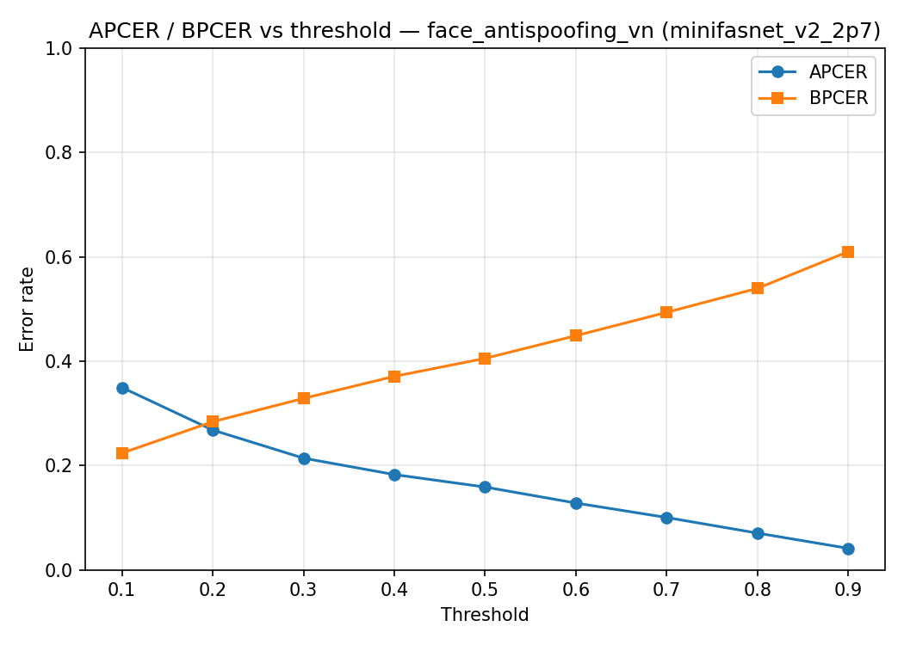 | 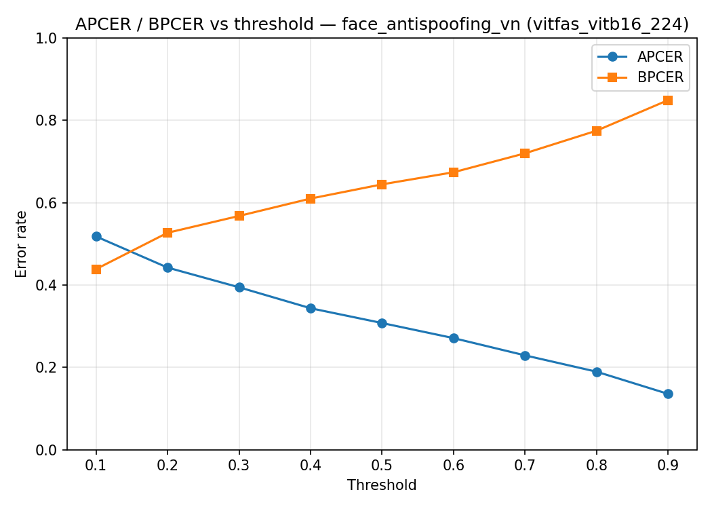 | 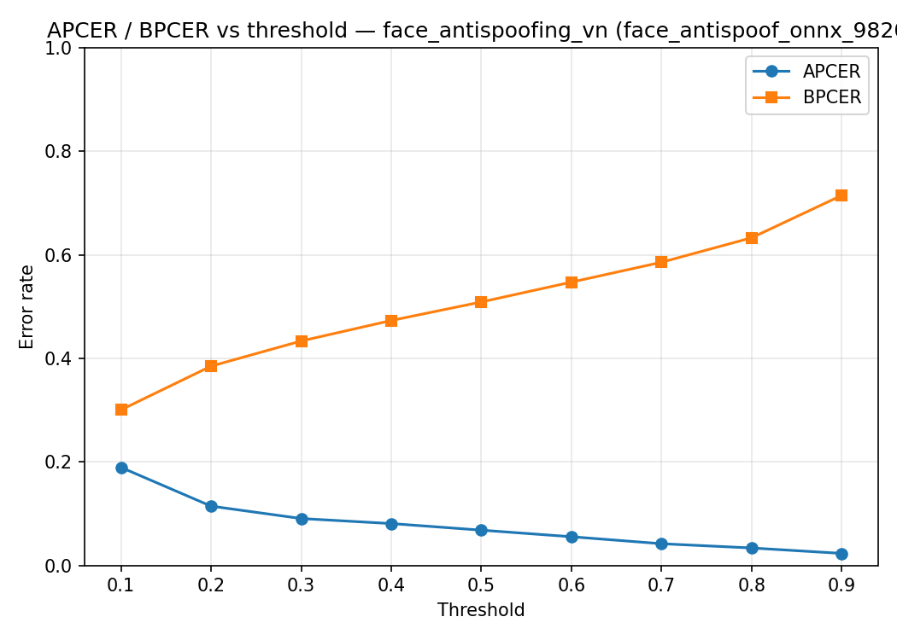 |

- Confusion matrix @ threshold 0.5 (dạng bảng):

| Model | TP (live→live) | FN (live→spoof) | FP (spoof→live) | TN (spoof→spoof) |
|-------|-----------------|-----------------|-----------------|------------------|
| MiniFASNet | 465 | 317 | 212 | 1124 |
| ViT-FAS | 278 | 504 | 411 | 925 |
| FaceAntispoof-ONNX | 384 | 398 | 91 | 1245 |

- Nhận xét ngắn: trên dữ liệu người Việt, **FaceAntispoof-ONNX** cho accuracy và APCER tốt nhất @0.5 (ít spoof lọt thành live), nhưng **BPCER cao** (nhiều live bị reject). **MiniFASNet** đứng thứ hai, cân bằng hơn BPCER @0.5 nhưng APCER cao hơn ONNX. **ViT-FAS** kém rõ trên domain VN (ACER ~0.48 @0.5) — khác với xu hướng trên CASIA/CelebA không đồng nhất, cần xem lại checkpoint/domain.

### 7.4 Drivers 250 FN (SFAS expansion)

291 mẫu **live** (GT không có spoof → **APCER = 0** mọi threshold). Crop SFAS `bbox_expansion` ∈ {1.0, 1.2, 1.4, 1.6}. Metric: `live_score` = **y_prob**; threshold 0.1–0.9 trong `configs/evaluation.yaml`.

#### SFAS exp 1.0 (`drivers_250_fn`)

| Model | Threshold | Accuracy | APCER | BPCER | ACER |
|-------|-----------|----------|-------|-------|------|
| MiniFASNet | 0.1 | 0.7801 | 0.0000 | 0.2199 | 0.1100 |
| MiniFASNet | 0.2 | 0.7045 | 0.0000 | 0.2955 | 0.1478 |
| MiniFASNet | 0.3 | 0.6735 | 0.0000 | 0.3265 | 0.1632 |
| MiniFASNet | 0.4 | 0.6254 | 0.0000 | 0.3746 | 0.1873 |
| MiniFASNet | 0.5 | 0.5636 | 0.0000 | 0.4364 | 0.2182 |
| MiniFASNet | 0.6 | 0.5120 | 0.0000 | 0.4880 | 0.2440 |
| MiniFASNet | 0.7 | 0.4502 | 0.0000 | 0.5498 | 0.2749 |
| MiniFASNet | 0.8 | 0.3986 | 0.0000 | 0.6014 | 0.3007 |
| MiniFASNet | 0.9 | 0.3230 | 0.0000 | 0.6770 | 0.3385 |
| ViT-FAS | 0.1 | 0.6357 | 0.0000 | 0.3643 | 0.1821 |
| ViT-FAS | 0.2 | 0.5670 | 0.0000 | 0.4330 | 0.2165 |
| ViT-FAS | 0.3 | 0.4983 | 0.0000 | 0.5017 | 0.2509 |
| ViT-FAS | 0.4 | 0.4502 | 0.0000 | 0.5498 | 0.2749 |
| ViT-FAS | 0.5 | 0.4227 | 0.0000 | 0.5773 | 0.2887 |
| ViT-FAS | 0.6 | 0.3883 | 0.0000 | 0.6117 | 0.3058 |
| ViT-FAS | 0.7 | 0.3333 | 0.0000 | 0.6667 | 0.3333 |
| ViT-FAS | 0.8 | 0.2646 | 0.0000 | 0.7354 | 0.3677 |
| ViT-FAS | 0.9 | 0.1787 | 0.0000 | 0.8213 | 0.4107 |
| ONNX | 0.1 | 0.5842 | 0.0000 | 0.4158 | 0.2079 |
| ONNX | 0.2 | 0.5017 | 0.0000 | 0.4983 | 0.2491 |
| ONNX | 0.3 | 0.4330 | 0.0000 | 0.5670 | 0.2835 |
| ONNX | 0.4 | 0.3883 | 0.0000 | 0.6117 | 0.3058 |
| ONNX | 0.5 | 0.3643 | 0.0000 | 0.6357 | 0.3179 |
| ONNX | 0.6 | 0.3265 | 0.0000 | 0.6735 | 0.3368 |
| ONNX | 0.7 | 0.3058 | 0.0000 | 0.6942 | 0.3471 |
| ONNX | 0.8 | 0.2680 | 0.0000 | 0.7320 | 0.3660 |
| ONNX | 0.9 | 0.2199 | 0.0000 | 0.7801 | 0.3900 |

| MiniFASNet | ViT-FAS | ONNX |
|:---:|:---:|:---:|
| 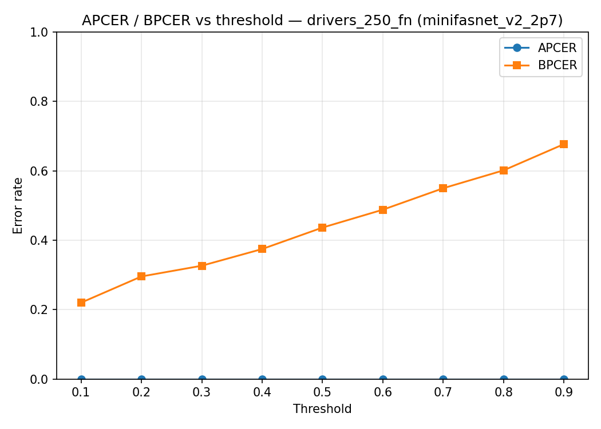 | 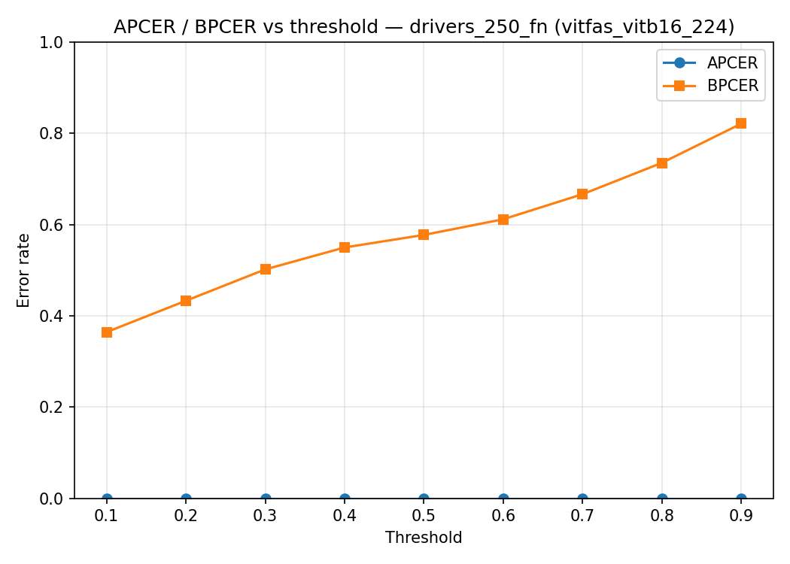 | 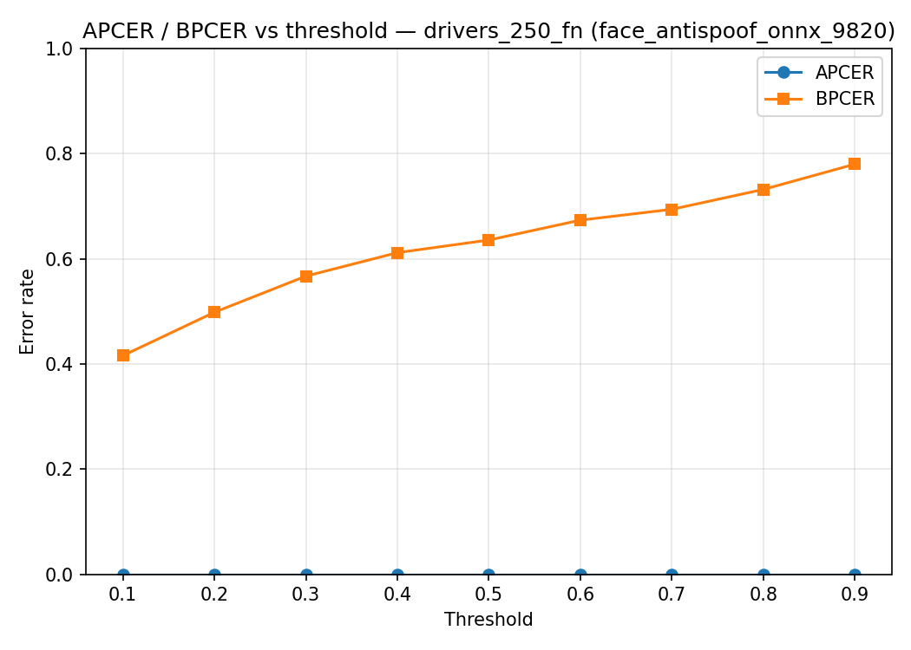 |

#### SFAS exp 1.2 (`drivers_250_fn_exp1.2`)

| Model | Threshold | Accuracy | APCER | BPCER | ACER |
|-------|-----------|----------|-------|-------|------|
| MiniFASNet | 0.1 | 0.9175 | 0.0000 | 0.0825 | 0.0412 |
| MiniFASNet | 0.2 | 0.8729 | 0.0000 | 0.1271 | 0.0636 |
| MiniFASNet | 0.3 | 0.8385 | 0.0000 | 0.1615 | 0.0808 |
| MiniFASNet | 0.4 | 0.8110 | 0.0000 | 0.1890 | 0.0945 |
| MiniFASNet | 0.5 | 0.7869 | 0.0000 | 0.2131 | 0.1065 |
| MiniFASNet | 0.6 | 0.7423 | 0.0000 | 0.2577 | 0.1289 |
| MiniFASNet | 0.7 | 0.7079 | 0.0000 | 0.2921 | 0.1460 |
| MiniFASNet | 0.8 | 0.6495 | 0.0000 | 0.3505 | 0.1753 |
| MiniFASNet | 0.9 | 0.5601 | 0.0000 | 0.4399 | 0.2199 |
| ViT-FAS | 0.1 | 0.7663 | 0.0000 | 0.2337 | 0.1168 |
| ViT-FAS | 0.2 | 0.6942 | 0.0000 | 0.3058 | 0.1529 |
| ViT-FAS | 0.3 | 0.6357 | 0.0000 | 0.3643 | 0.1821 |
| ViT-FAS | 0.4 | 0.5979 | 0.0000 | 0.4021 | 0.2010 |
| ViT-FAS | 0.5 | 0.5704 | 0.0000 | 0.4296 | 0.2148 |
| ViT-FAS | 0.6 | 0.5120 | 0.0000 | 0.4880 | 0.2440 |
| ViT-FAS | 0.7 | 0.4811 | 0.0000 | 0.5189 | 0.2595 |
| ViT-FAS | 0.8 | 0.4261 | 0.0000 | 0.5739 | 0.2869 |
| ViT-FAS | 0.9 | 0.3574 | 0.0000 | 0.6426 | 0.3213 |
| ONNX | 0.1 | 0.8110 | 0.0000 | 0.1890 | 0.0945 |
| ONNX | 0.2 | 0.7457 | 0.0000 | 0.2543 | 0.1271 |
| ONNX | 0.3 | 0.7079 | 0.0000 | 0.2921 | 0.1460 |
| ONNX | 0.4 | 0.6735 | 0.0000 | 0.3265 | 0.1632 |
| ONNX | 0.5 | 0.6460 | 0.0000 | 0.3540 | 0.1770 |
| ONNX | 0.6 | 0.6186 | 0.0000 | 0.3814 | 0.1907 |
| ONNX | 0.7 | 0.5808 | 0.0000 | 0.4192 | 0.2096 |
| ONNX | 0.8 | 0.5464 | 0.0000 | 0.4536 | 0.2268 |
| ONNX | 0.9 | 0.5017 | 0.0000 | 0.4983 | 0.2491 |

| MiniFASNet | ViT-FAS | ONNX |
|:---:|:---:|:---:|
| 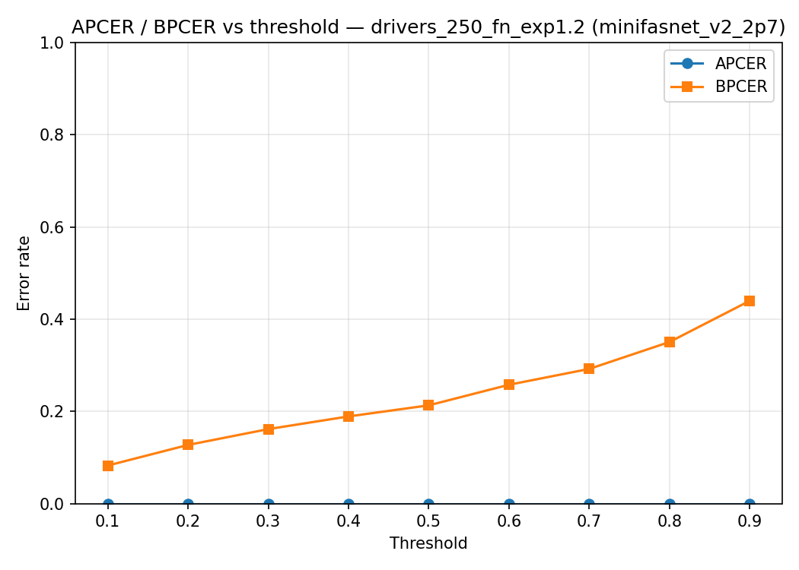 | 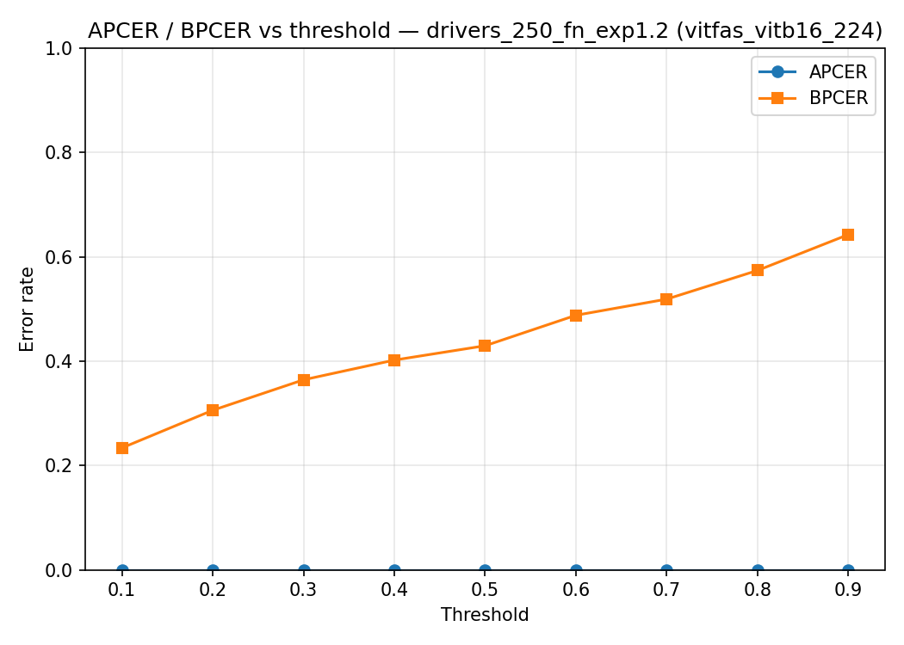 | 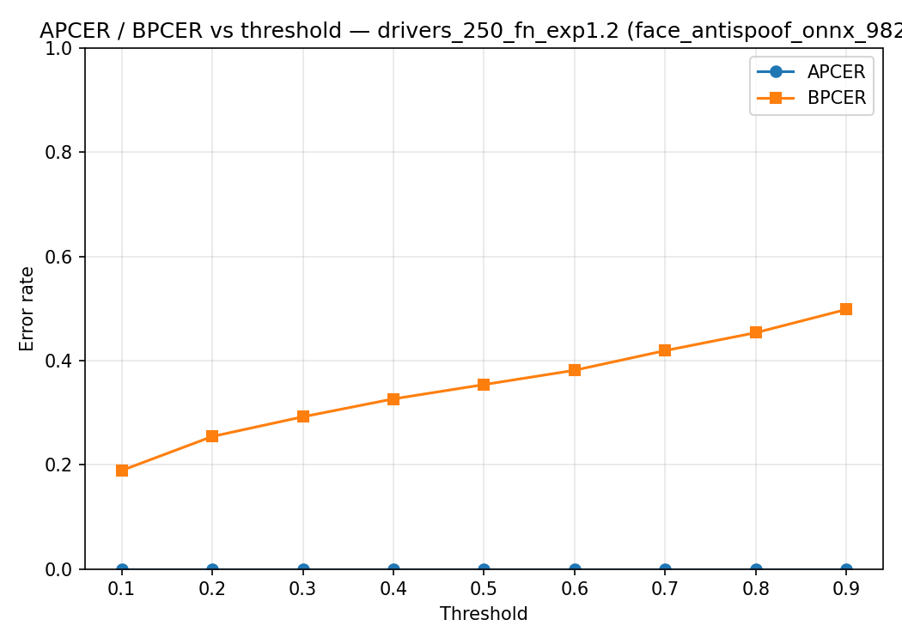 |

#### SFAS exp 1.4 (`drivers_250_fn_exp1.4`)

| Model | Threshold | Accuracy | APCER | BPCER | ACER |
|-------|-----------|----------|-------|-------|------|
| MiniFASNet | 0.1 | 0.9863 | 0.0000 | 0.0137 | 0.0069 |
| MiniFASNet | 0.2 | 0.9725 | 0.0000 | 0.0275 | 0.0137 |
| MiniFASNet | 0.3 | 0.9347 | 0.0000 | 0.0653 | 0.0326 |
| MiniFASNet | 0.4 | 0.9107 | 0.0000 | 0.0893 | 0.0447 |
| MiniFASNet | 0.5 | 0.8969 | 0.0000 | 0.1031 | 0.0515 |
| MiniFASNet | 0.6 | 0.8832 | 0.0000 | 0.1168 | 0.0584 |
| MiniFASNet | 0.7 | 0.8625 | 0.0000 | 0.1375 | 0.0687 |
| MiniFASNet | 0.8 | 0.8351 | 0.0000 | 0.1649 | 0.0825 |
| MiniFASNet | 0.9 | 0.7904 | 0.0000 | 0.2096 | 0.1048 |
| ViT-FAS | 0.1 | 0.8832 | 0.0000 | 0.1168 | 0.0584 |
| ViT-FAS | 0.2 | 0.8282 | 0.0000 | 0.1718 | 0.0859 |
| ViT-FAS | 0.3 | 0.7835 | 0.0000 | 0.2165 | 0.1082 |
| ViT-FAS | 0.4 | 0.7595 | 0.0000 | 0.2405 | 0.1203 |
| ViT-FAS | 0.5 | 0.7182 | 0.0000 | 0.2818 | 0.1409 |
| ViT-FAS | 0.6 | 0.6804 | 0.0000 | 0.3196 | 0.1598 |
| ViT-FAS | 0.7 | 0.6392 | 0.0000 | 0.3608 | 0.1804 |
| ViT-FAS | 0.8 | 0.5876 | 0.0000 | 0.4124 | 0.2062 |
| ViT-FAS | 0.9 | 0.5052 | 0.0000 | 0.4948 | 0.2474 |
| ONNX | 0.1 | 0.8935 | 0.0000 | 0.1065 | 0.0533 |
| ONNX | 0.2 | 0.8557 | 0.0000 | 0.1443 | 0.0722 |
| ONNX | 0.3 | 0.8247 | 0.0000 | 0.1753 | 0.0876 |
| ONNX | 0.4 | 0.7973 | 0.0000 | 0.2027 | 0.1014 |
| ONNX | 0.5 | 0.7629 | 0.0000 | 0.2371 | 0.1186 |
| ONNX | 0.6 | 0.7182 | 0.0000 | 0.2818 | 0.1409 |
| ONNX | 0.7 | 0.6942 | 0.0000 | 0.3058 | 0.1529 |
| ONNX | 0.8 | 0.6735 | 0.0000 | 0.3265 | 0.1632 |
| ONNX | 0.9 | 0.6220 | 0.0000 | 0.3780 | 0.1890 |

| MiniFASNet | ViT-FAS | ONNX |
|:---:|:---:|:---:|
| 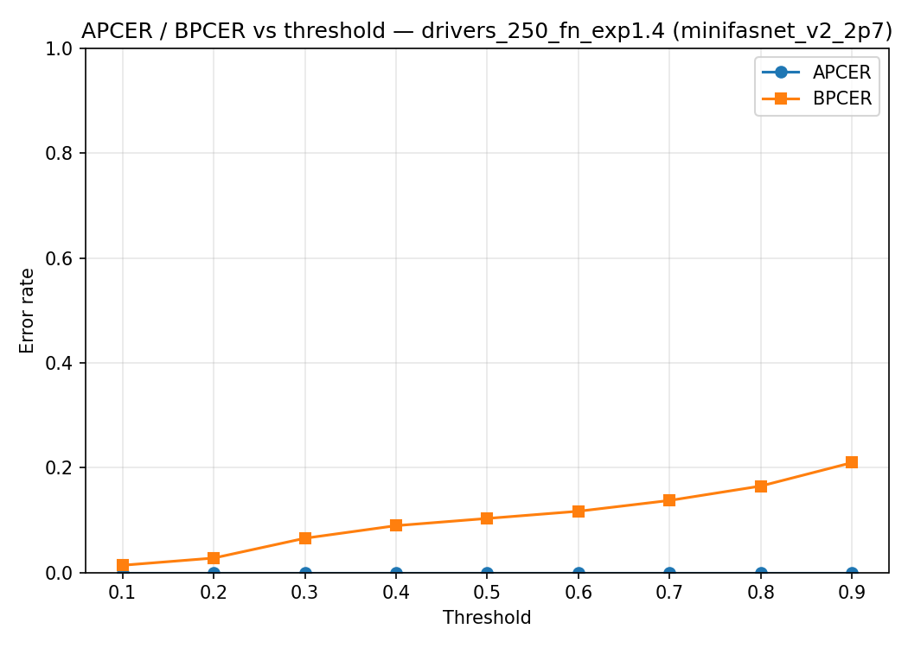 | 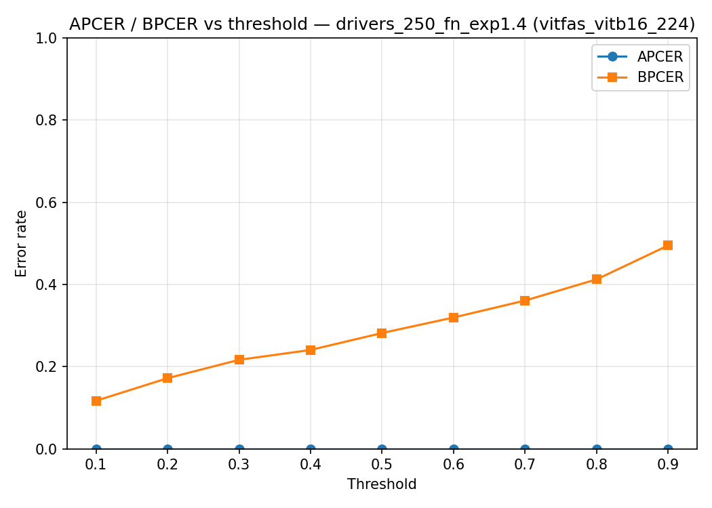 | 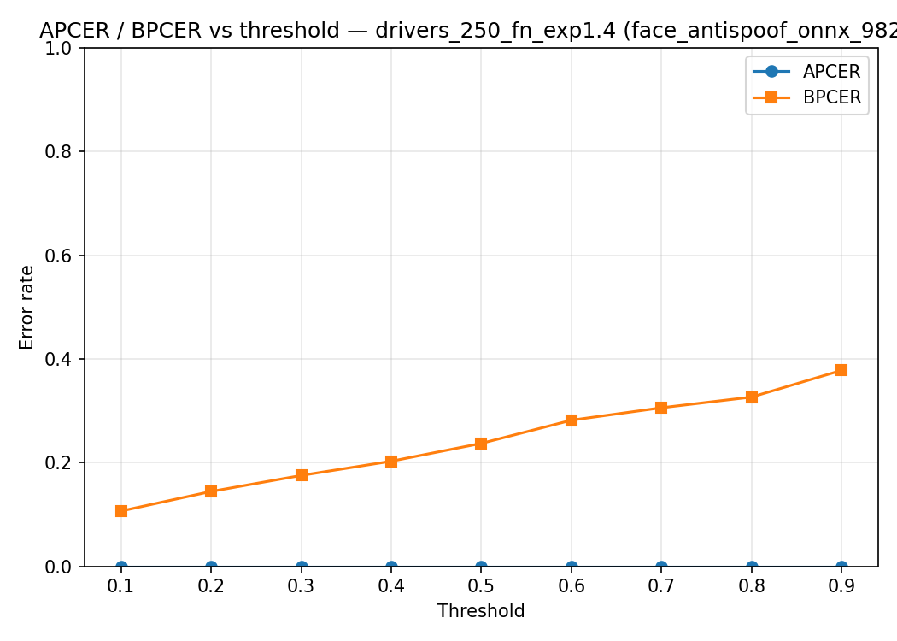 |

#### SFAS exp 1.6 (`drivers_250_fn_exp1.6`)

| Model | Threshold | Accuracy | APCER | BPCER | ACER |
|-------|-----------|----------|-------|-------|------|
| MiniFASNet | 0.1 | 0.9966 | 0.0000 | 0.0034 | 0.0017 |
| MiniFASNet | 0.2 | 0.9828 | 0.0000 | 0.0172 | 0.0086 |
| MiniFASNet | 0.3 | 0.9691 | 0.0000 | 0.0309 | 0.0155 |
| MiniFASNet | 0.4 | 0.9553 | 0.0000 | 0.0447 | 0.0223 |
| MiniFASNet | 0.5 | 0.9519 | 0.0000 | 0.0481 | 0.0241 |
| MiniFASNet | 0.6 | 0.9485 | 0.0000 | 0.0515 | 0.0258 |
| MiniFASNet | 0.7 | 0.9416 | 0.0000 | 0.0584 | 0.0292 |
| MiniFASNet | 0.8 | 0.9244 | 0.0000 | 0.0756 | 0.0378 |
| MiniFASNet | 0.9 | 0.9038 | 0.0000 | 0.0962 | 0.0481 |
| ViT-FAS | 0.1 | 0.9175 | 0.0000 | 0.0825 | 0.0412 |
| ViT-FAS | 0.2 | 0.8866 | 0.0000 | 0.1134 | 0.0567 |
| ViT-FAS | 0.3 | 0.8557 | 0.0000 | 0.1443 | 0.0722 |
| ViT-FAS | 0.4 | 0.8351 | 0.0000 | 0.1649 | 0.0825 |
| ViT-FAS | 0.5 | 0.8144 | 0.0000 | 0.1856 | 0.0928 |
| ViT-FAS | 0.6 | 0.7938 | 0.0000 | 0.2062 | 0.1031 |
| ViT-FAS | 0.7 | 0.7629 | 0.0000 | 0.2371 | 0.1186 |
| ViT-FAS | 0.8 | 0.6976 | 0.0000 | 0.3024 | 0.1512 |
| ViT-FAS | 0.9 | 0.6357 | 0.0000 | 0.3643 | 0.1821 |
| ONNX | 0.1 | 0.9210 | 0.0000 | 0.0790 | 0.0395 |
| ONNX | 0.2 | 0.8866 | 0.0000 | 0.1134 | 0.0567 |
| ONNX | 0.3 | 0.8660 | 0.0000 | 0.1340 | 0.0670 |
| ONNX | 0.4 | 0.8316 | 0.0000 | 0.1684 | 0.0842 |
| ONNX | 0.5 | 0.8110 | 0.0000 | 0.1890 | 0.0945 |
| ONNX | 0.6 | 0.7801 | 0.0000 | 0.2199 | 0.1100 |
| ONNX | 0.7 | 0.7629 | 0.0000 | 0.2371 | 0.1186 |
| ONNX | 0.8 | 0.7182 | 0.0000 | 0.2818 | 0.1409 |
| ONNX | 0.9 | 0.6804 | 0.0000 | 0.3196 | 0.1598 |

| MiniFASNet | ViT-FAS | ONNX |
|:---:|:---:|:---:|
|  |  |  |

### 7.5 Ma trận benchmark — tóm tắt @0.5

`run_inference.py --all` + `run_evaluation.py --all`. Bảng đầy đủ threshold: §7.1–7.4.

| Dataset | MiniFASNet BPCER / APCER | ViT-FAS | ONNX |
|---------|-------------------------|---------|------|
| celeba_spoof | 0.355 / 0.269 | 0.528 / 0.183 | **0.126** / 0.191 |
| casia_fasd | 0.153 / **0.013** | 0.240 / 0.423 | 0.104 / 0.356 |
| face_antispoofing_vn | 0.405 / 0.159 | 0.645 / 0.308 | 0.509 / **0.068** |
| drivers_250_fn (exp 1.0) | 0.436 / 0 | 0.577 / 0 | 0.636 / 0 |
| drivers_250_fn_exp1.2 | 0.213 / 0 | 0.430 / 0 | 0.354 / 0 |
| drivers_250_fn_exp1.4 | 0.103 / 0 | 0.282 / 0 | 0.237 / 0 |
| drivers_250_fn_exp1.6 | **0.048** / 0 | 0.186 / 0 | 0.189 / 0 |

#### 7.5.1 Dataset × dự đoán @0.5 (`True` / `False`)

`True` = pass (pred live); `False` = reject (pred spoof). Định dạng **True / False** (số mẫu).

| Dataset | MiniFASNet | ViT-FAS | ONNX |
|---------|------------|---------|------|
| celeba_spoof (4000) | 1827 / 2173 | 1309 / 2691 | 2130 / 1870 |
| casia_fasd (4063) | 883 / 3180 | 2055 / 2008 | 1983 / 2080 |
| face_antispoofing_vn (2118) | 677 / 1441 | 689 / 1429 | 475 / 1643 |
| drivers_250_fn (291 live) | 164 / 127 | 123 / 168 | 106 / 185 |
| drivers_250_fn_exp1.2 | 229 / 62 | 166 / 125 | 188 / 103 |
| drivers_250_fn_exp1.4 | 261 / 30 | 209 / 82 | 222 / 69 |
| drivers_250_fn_exp1.6 | 277 / 14 | 237 / 54 | 236 / 55 |

#### 7.5.2 Phân phối `y_prob` @0.5 (nhóm True / False)

**Drivers exp 1.6** (291 live):

| Model | Nhóm | n | mean | p10 | p50 | p90 |
|-------|------|---:|-----:|----:|----:|----:|
| MiniFASNet | True | 277 | 0.981 | 0.944 | 0.999 | 1.000 |
| MiniFASNet | False | 14 | 0.235 | 0.138 | 0.208 | 0.375 |
| ViT-FAS | True | 237 | 0.931 | 0.758 | 0.988 | 0.995 |
| ViT-FAS | False | 54 | 0.164 | 0.010 | 0.117 | 0.399 |
| ONNX | True | 236 | 0.948 | 0.779 | 0.999 | 1.000 |
| ONNX | False | 55 | 0.179 | 0.004 | 0.137 | 0.402 |

Histogram toàn tập @ exp 1.6:

| Bin | MiniFASNet | ViT-FAS | ONNX |
|-----|----------:|--------:|-----:|
| [0, 0.2) | 5 | 33 | 33 |
| [0.2, 0.4) | 8 | 15 | 16 |
| [0.4, 0.6) | 2 | 12 | 15 |
| [0.6, 0.8) | 7 | 28 | 18 |
| [0.8, 1.0] | 269 | 203 | 209 |

- **Drivers:** SFAS expansion ↑ → BPCER ↓; MiniFASNet @ exp 1.6 đạt BPCER 4.8% @0.5. Biểu đồ đường cong: §7.1–7.4 (mỗi dataset). Crop: `drivers_250_fn_sfas_crop_and_evaluation.md`.

### 7.6 So sánh giữa các dataset

| Tiêu chí | CelebA-Spoof | CASIA-FASD | Face Anti-Spoofing VN | Drivers 250 FN |
|----------|--------------|------------|------------------------|----------------|
| MiniFASNet ACER @ 0.5 | 0.3118 | 0.0829 | 0.2820 | 0.2182 |
| ViT-FAS ACER @ 0.5 | 0.3558 | 0.3318 | 0.4761 | 0.2887 |
| FaceAntispoof-ONNX ACER @ 0.5 | 0.1585 | 0.2296 | 0.2885 | 0.3179 |
| MiniFASNet BPCER @ 0.5 | 0.3550 | 0.1528 | 0.4054 | 0.4364 (exp 1.0) → **0.0481** (exp 1.6) |
| ViT-FAS BPCER @ 0.5 | 0.5285 | 0.2402 | 0.6445 | 0.5773 (exp 1.0) → 0.1856 (exp 1.6) |
| FaceAntispoof-ONNX BPCER @ 0.5 | 0.1260 | 0.1035 | 0.5090 | 0.6357 (exp 1.0) → 0.1890 (exp 1.6) |
| Số mẫu (test/sample) | 4000 | 4063 | 2118 (782 live / 1336 spoof) | 291 (291 live / 0 spoof) × 4 expansion |
| Độ khó / domain | CelebA cân bằng, phân tách khó | CASIA khớp train MiniFASNet | VN OOD; ONNX hơn MiniFASNet theo accuracy | Production FN; BPCER phụ thuộc mạnh SFAS bbox expansion |
| Preprocess đầu vào | resize + normalize theo wrapper | resize + normalize theo wrapper | crop SFAS + resize theo wrapper | crop SFAS (exp 1.0–1.6) + resize theo wrapper |

### 7.7 Artifact minh họa

- Trước / sau crop (tham khảo): `reports/casia_crop_before_after_10.png`
- Failure cases: `reports/failure_cases/`

---

## 8. Phân tích failure cases

### 8.1 False accept (spoof → live) — rủi ro bảo mật

- Số lượng / tỷ lệ:
- Ví dụ điển hình (đường dẫn ảnh):
- Pattern (màn hình HD, in ảnh, ánh sáng, …):

### 8.2 False reject (live → spoof) — ảnh hưởng UX

- Số lượng / tỷ lệ:
- Ví dụ:
- Pattern (mờ, nghiêng, tối, …):

### 8.3 Lỗi kỹ thuật (detect / inference)

- Không detect mặt:
- Lỗi đọc ảnh / preprocess:

---

## 9. Thảo luận

### 9.1 Domain và độ khớp dữ liệu với pretrained

- 

### 9.2 Ảnh đã crop sẵn (HF) vs crop offline

- 

### 9.3 Ưu tiên metric cho production (APCER vs Accuracy)

- 

### 9.4 Hạn chế thí nghiệm

- Chỉ một model / một weight
- Sample size, chưa fine-tune
- Khác:

---

## 10. Kết luận và đề xuất

### 10.1 Kết luận

- Với dữ liệu thực tế `drivers_250_fn` (291 mẫu live), tiêu chí quyết định là **BPCER** (tỷ lệ live bị reject).
- **SFAS crop exp 1.0 (baseline):** @0.5 — MiniFASNet BPCER 0.4364 > ViT-FAS 0.5773 > ONNX 0.6357 → **NO-GO** cả 3 model.
- **SFAS crop exp 1.6:** @0.5 — MiniFASNet **BPCER 0.0481** (14 FN); @0.3 — **BPCER 0.0309** (9 FN). ViT-FAS / ONNX ~0.19 @0.5 → vẫn **NO-GO**.
- **MiniFASNet + SFAS exp 1.6** là cấu hình duy nhất trong benchmark hiện tại **đạt acceptance gate đề xuất (BPCER ≤ 0.10)** trên tập `drivers_250_fn`; cần validation thêm (ảnh hưởng APCER trên tập có spoof, đồng bộ pipeline production, A/B vận hành) trước khi chuyển **GO**.
- Kết luận triển khai: **NO-GO @ exp 1.0**; **conditional / pilot GO** chỉ cho **MiniFASNet @ SFAS bbox expansion 1.6** sau khi ops phê duyệt ngưỡng và kiểm tra bảo mật trên tập spoof.

### 10.2 Phân tích từng mô hình trên `drivers_250_fn`

| Model | Điểm mạnh | Điểm yếu | Nhận định phù hợp |
|------|-----------|----------|-------------------|
| MiniFASNet (`minifasnet_v2_2p7`) | BPCER thấp nhất trong 3 model; @ SFAS exp 1.6 đạt BPCER ≤ 0.10; phân tách score pass/reject rõ | @ exp 1.0 vẫn NO-GO; APCER trên tập cân bằng không tốt nhất | **Phù hợp nhất** — triển khai kèm **SFAS bbox expansion 1.6** |
| ViT-FAS (`vitfas_vitb16_224`) | Có thể chạy end-to-end ổn định trong pipeline hiện tại | BPCER cao trên `drivers_250_fn`; ACER cao trên VN/CASIA; chất lượng chưa đạt mức deploy | Chưa phù hợp để làm model chính; chỉ nên giữ cho mục đích benchmark nội bộ |
| FaceAntispoof-ONNX (`face_antispoof_onnx_9820`) | APCER rất tốt trên VN/CelebA; mạnh ở mục tiêu giảm spoof lọt | BPCER cao nhất trên `drivers_250_fn` (reject live nhiều); độ phù hợp production thấp nếu KPI ưu tiên UX | Phù hợp cho kịch bản ưu tiên bảo mật cao; cần calibrate threshold/fine-tune trước khi dùng làm model chính |

### 10.3 Đề xuất tích hợp service

| Hạng mục | Đề xuất |
|----------|---------|
| Trạng thái triển khai | **NO-GO @ SFAS exp 1.0**; **pilot có điều kiện** cho MiniFASNet @ **exp 1.6** (BPCER 0.048 @0.5) sau validation spoof |
| Model anti-spoofing | **MiniFASNetV2** + SFAS expansion **1.6**; ONNX/ViT chưa đạt gate trên cùng crop |
| Ngưỡng operating point | @ exp 1.6: có thể dùng **0.5** (BPCER 4.8%) hoặc **0.3** (3.1%); tune trên tập live mở rộng |
| Acceptance gate đề xuất | **BPCER ≤ 0.10** trên tập live thực tế — MiniFASNet @ exp 1.6 đã đạt trên `drivers_250_fn` (291 mẫu) |
| Preprocessing (detect + crop) | Production: áp dụng **bbox_expansion=1.6** (SFAS `CropImage._get_new_box`); đồng bộ với benchmark |
| Bước tiếp theo (fine-tune, data nội bộ) | Xác nhận APCER trên tập spoof VN; mở rộng `drivers_250_fn`; A/B exp 1.4 vs 1.6 trên latency/quality |

### 10.4 Công việc tiếp theo

- [ ] Kiểm tra sâu nhánh load/checkpoint ViT-FAS và thống nhất class order live/spoof.
- [ ] Calibrate threshold theo KPI production (ưu tiên BPCER trên live thực tế `drivers_250_fn`).
- [ ] Chạy lại ONNX với sweep threshold + báo cáo trade-off APCER/BPCER theo ngưỡng.
- [ ] Chạy benchmark lặp lại nhiều seed để đo độ ổn định metric.
- [ ] Bổ sung tập validation nội bộ để chọn threshold theo KPI service.

---

## Phụ lục

### A. Cây thư mục artifact chính

```
reports/
  predictions/
  metrics/<dataset>/
  failure_cases/
  REPORT.md
data/
  raw/
  sampled/
  processed/
  labeled/
```

### B. Lệnh pipeline đầy đủ (copy từ README)

*(Điền hoặc link README.md.)*

### C. Tài liệu tham khảo

- Silent-Face-Anti-Spoofing / MiniFASNet
- CelebA-Spoof
- CASIA-FASD
- ISO/IEC 30107 (APCER, BPCER, ACER)

### D. Changelog báo cáo

| Ngày | Phiên bản | Thay đổi |
|------|-----------|----------|
| 28/05/2026 | v0.1 | Khởi tạo mẫu |
| 29/05/2026 | v0.2 | Bổ sung kết quả `face_antispoofing_vn` (3 model) |
| 01/06/2026 | v0.3 | Bổ sung đánh giá `drivers_250_fn`, thêm metric BPCER trọng tâm cho production, thay confusion matrix ảnh bằng bảng markdown |
| 01/06/2026 | v0.4 | Cập nhật mục 10: phân tích model phù hợp nhất cho `drivers_250_fn`, nêu điểm mạnh/yếu từng model theo dữ liệu thực tế |
| 01/06/2026 | v0.5 | Chốt kết luận NO-GO cho production trên `drivers_250_fn`; bổ sung acceptance gate theo BPCER |
| 01/06/2026 | v0.6 | Ablation SFAS bbox expansion (1.0–1.6); bảng dataset×pred True/False; phân phối `live_score`; đường cong BPCER vs threshold (mermaid); cập nhật kết luận MiniFASNet @ exp 1.6 |
| 01/06/2026 | v0.7 | Ma trận 3×7 (`--all`); bảng True/False + phân phối y_prob; nhúng PNG `apcer_bpcer_vs_threshold` (thay mermaid) |
| 01/06/2026 | v0.8 | Metric đầy đủ threshold 0.1–0.9 (HF + drivers); biểu đồ APCER/BPCER nhúng trong §7.1–7.4 |
